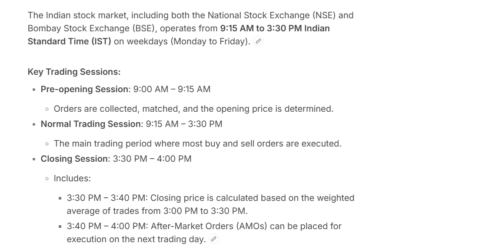

---

# 📈 InvestIQ - Smart Portfolio & Wealth Management

InvestIQ is an advanced, full-stack FinTech application built to simulate real-world investing in the Indian Stock Market (NSE/BSE). Designed as a premium trading terminal, it features real-time market synchronization, secure simulated payment processing, dynamic visual analytics, and an automated background database audit system.

Developed specifically as a comprehensive Database Management System (DBMS) project, InvestIQ showcases complex SQL relationships, automated triggers, and a highly responsive React architecture without relying on external CSS frameworks.

---

## ✨ Key Features

* **🔴 Live Market Synchronization:** Fetches and mathematically blends real-time stock prices (Reliance, TCS, HDFC, etc.) via Yahoo Finance APIs to calculate exact live portfolio values and "Today's P&L" every 5 seconds.
* **⭐ Dynamic Watchlist:** Persistently track your favorite assets before buying. Add and remove global tickers with instant live-price binding.
* **⚡ Global Search Engine:** Press `⌘ + K` or `/` to instantly search and add any global or Indian stock ticker directly to your live marketplace.
* **📊 Premium Trading Terminal UI:** A completely custom-built, high-end user interface using pure CSS (glassmorphism, smooth transitions, and deep color palettes) resembling professional tools like Groww or Zerodha.
* **📈 Deep Visual Analytics:** Interactive and auto-recalculating Donut, Radar, Bar, and Area charts using `recharts`. Features live portfolio benchmarking and 5-year wealth projections.
* **💳 Simulated Transactions:** Securely process "Delivery" and "Intraday" orders using the **Stripe Payment Gateway** (Test Mode).
* **📑 One-Click PDF Reports:** Generate and download high-resolution, stylized portfolio analytics reports directly to your local machine.
* **🛡️ Automated Audit Logs (DBMS Triggers):** MySQL triggers autonomously record every buy/sell action in the background, maintaining strict financial ledgers without relying on backend logic.

---

## 🛠️ Tech Stack

* **Frontend:** React.js, Custom Pure CSS (No Tailwind), Framer Motion (Fluid Animations), Lucide React (Icons).
* **Backend:** Node.js, Express.js.
* **Database:** MySQL (Relational tables, Foreign Keys, Unique Constraints, Triggers).
* **APIs & Libraries:** `yahoo-finance2` (Live Data), `socket.io` (Real-time streams), `stripe` (Payments), `html-to-image` & `jspdf` (Exporting), `recharts` (Data Visualization).

---

## 🗄️ Database Architecture

As a DBMS-focused project, InvestIQ utilizes a strictly normalized relational database structure:

1. **`users`**: Secure credential storage with encrypted passwords.
2. **`funds` / `marketplace**`: Available assets tied to global ticker symbols.
3. **`portfolio`**: Active user holdings linking users to funds with tracked investment amounts and order types.
4. **`watchlist`**: A junction table with `UNIQUE` constraints preventing duplicate asset tracking per user.
5. **`audit_logs`**: An immutable ledger populated exclusively via SQL `AFTER INSERT` and `AFTER DELETE` triggers on the portfolio table.

---

## ⚙️ Local Installation & Setup

### 1. Prerequisites

Make sure you have [Node.js](https://nodejs.org/) and [XAMPP](https://www.apachefriends.org/) (for MySQL) installed on your machine.

### 2. Clone the Repository

```bash
git clone https://github.com/Bructi/investiq.git
cd investiq 

```

### 3. Database Configuration

1. Open XAMPP and start the **MySQL** module.
2. Open your terminal or MySQL Workbench and create the database:
```sql
CREATE DATABASE investiq_db;

```


3. Import the provided SQL schemas located in the `database/` folder to generate the tables, constraints, and triggers.

### 4. Backend Setup

```bash
cd backend
npm install

```

Create a `.env` file in the `backend` directory and add your credentials:

```env
PORT=5000
DB_HOST=localhost
DB_USER=root
DB_PASS=
DB_NAME=investiq_db
JWT_SECRET=your_super_secret_key
STRIPE_SECRET_KEY=sk_test_your_stripe_key

```

Start the backend server:

```bash
npm start

```

### 5. Frontend Setup

Open a new terminal window:

```bash
cd frontend
npm install
npm run dev

```

The application will securely launch on `http://localhost:5173`.

---

## 💳 Testing Payments & Orders

InvestIQ integrates with Stripe in strict **Test Mode**. When purchasing an asset, you will be redirected to a secure checkout session.

Use standard Stripe test cards (e.g., `4242 4242 4242 4242`) to simulate successful investments. Upon success, the database triggers will update your holdings, and the live dashboard will immediately reflect your new assets.

**View Simulated Transactions:**
You can monitor the successful test orders directly in the Stripe Dashboard:
[🔗 View InvestIQ Stripe Test Payments](https://dashboard.stripe.com/test/payments)

## Market Timing


